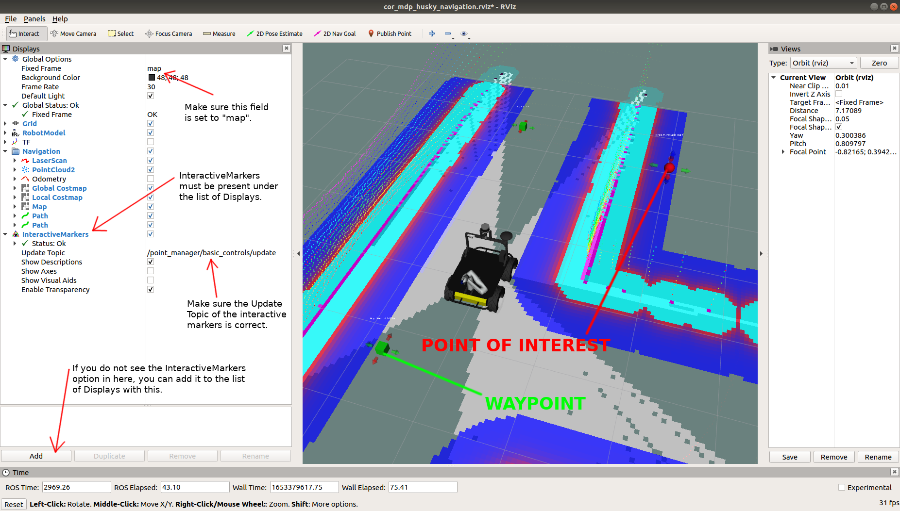

# The point_mgmt package

This package provides functionalities for managing interactive markers within RViz (or other compatible visualization tools).

## File structure

The package is organised in the following manner:

[//]: # (Symbols we can use for folder structure  │  ├  ─  └)
```
point_mgmt
 │
 ├─── CMakeLists.txt
 │
 ├─── package.xml
 │
 ├─── README.md
 │
 │
 ├─── config
 │     └─── points.txt
 │
 ├─── include
 │     └─── point_mgr.h
 │
 ├─── launch
 │     └─── point_mgmt.launch
 │
 └─── src
       ├─── point_mgr.cpp
       └─── point_mgr_main.cpp
```

## Package summary

Essentially, this package provides the definition of a class, ```PointMGR```, which can dynamically manage sets of waypoints and points-of-interest, and can be interacted with by means of a number of specified services that can be called from anywhere else using regular ros clients defined in your own code, or through the command line with ```rosservice call```.

The ```PointMGR``` class is declared and implemented in the ```point_mgr.h``` and ```point_mgr.cpp``` files, respectively.

The ```point_mgr_main.cpp``` file provides a simple main function encapsulating the class within a familiar ros node.

The ```points.txt``` file keeps a saved record of the managed waypoints and points-of-interest. It can be modified manually, or by means of services, which we will describe the workings of in the section about **interfacing with the Point Manager**.

Finally, ```point_mgmt.launch``` is a simple launch file which encapsulates our point manager node and the standard husky samxl setup provided to us by the Multidisciplinary Project course organisers.

## Building the code

To build the code, make sure it is present within the catkin workspace you intend to build from. Additionally, make sure the necessary companion package ```point_mgmt_msgs``` is also present (as you can probably easily guess, this package defines specific service message types for the proper functioning of the point manager). Then, execute the following command:

```
:<your_catkin_ws_path>$ catkin build
```

## Running the code

Here are the commands necessary for running a simple ```point_mgmt``` node, along with the Multidisciplinary project simulation setup:
```
:<your_catkin_ws_path>$ source devel/setup.bash
:<your_catkin_ws_path>$ roslaunch point_mgmt point_mgmt.launch
```
With this launch file, a separate terminal should pop up. This terminal is used to show every process that the point manager is taking care of while the simulation is running (ie, updating the state of points as they are being displaced, added or removed, as well as providing information when the points are being saved, or giving away the location of a point when requested).

Otherwise, the node can be run on its own, without any other ROS process, with:
```
:<your_catkin_ws_path>$ source devel/setup.bash
:<your_catkin_ws_path>$ rosrun point_mgmt point_mgmt_node
```
Make sure the ROSmaster is online before running this node (with running ```roscore``` in a separate terminal).

## Making sure the markers are rendered within the RViz Window

If the points are not visible on RViz, follow the instructions indicated on the picture below.



## Interfacing with the Point Manager

You can get a list of the available services the point manager provides with the following command:

```
:<any_directory>$ rosservice list point_manager
```

It should yield the following output:

```
/point_manager/get_point_of_interest_location
/point_manager/get_waypoint_location
/point_manager/kill_point_of_interest
/point_manager/kill_waypoint
/point_manager/load_points
/point_manager/point_mgr/get_loggers
/point_manager/point_mgr/set_logger_level
/point_manager/save_points
/point_manager/spawn_point_of_interest
/point_manager/spawn_waypoint
/point_manager/summarise_points
```

- You can **move** waypoints and points of interest directly within the RViz window, either by dragging them along the screen, or by dragging the arrows, for more precision.
- You can **delete** points by calling their respective ```kill``` service. You need to specify the name of the marker you wish to kill as part of the call. (for example, if you wish to delete a waypoint called "R2D2", your call should look like: ```rosservice call /point_manager/kill_waypoint R2D2```). Upon killing a point, it will be directly removed from the RViz window.
- You can **add** points by calling their respective ```spawn``` service. The syntax for the service call is similar to killing a point. Using a ```spawn``` service directly renders the new point on RViz, making it instantly available for moving it anywhere you want.
- You can **save** the current state of all waypoints and points of interest that are present within RViz into a ```.txt``` file by using the ```save_points``` service (which does not require any arguments). An informative message will be shown on the point manager terminal, specifying where the file has been saved (by default, it should be located within the ```config``` directory of this package).
- You can **load** points from the file you saved your points to, by calling the ```load_points``` service (it does not require any arguments).
- You can get information about points' **coordinates** by calling their respective ```get_<point_type>_location``` service. Specify the name of the point you would like to obtain information about as an argument.
- Finally, you can get a short **summary** of every point currently managed by the node, by calling the ```summarise_points``` service. The summary will be displayed on the point manager terminal.

You can also create your own custom client nodes within your own application/code, by using [ROS clients](http://wiki.ros.org/ROS/Tutorials/WritingServiceClient%28c%2B%2B%29).
